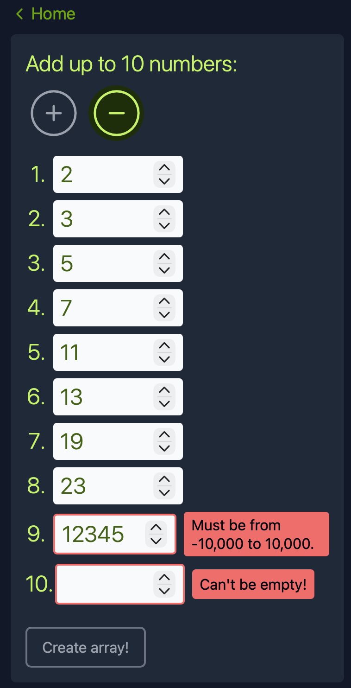
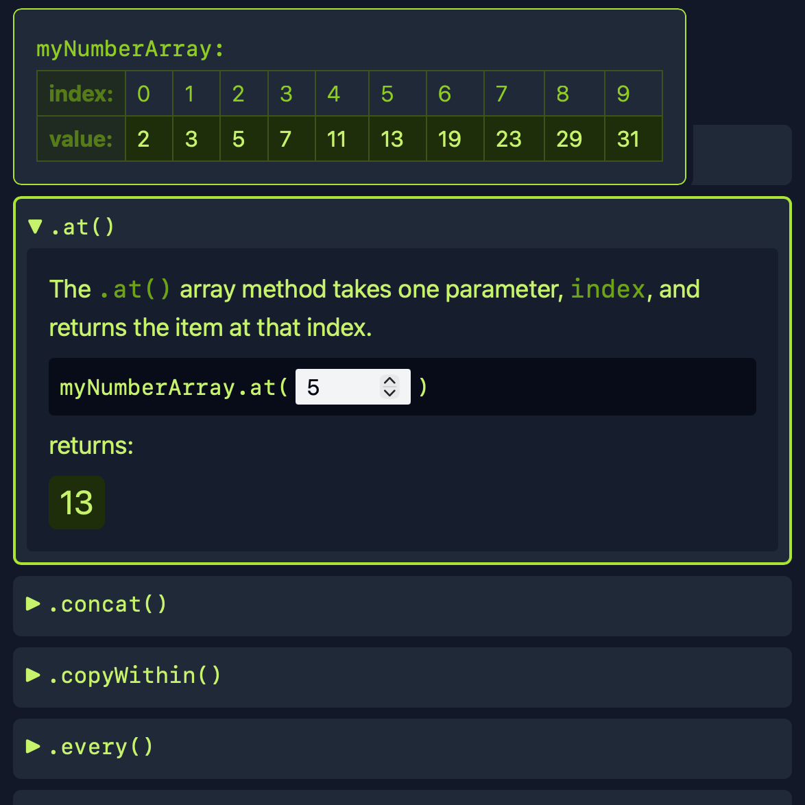
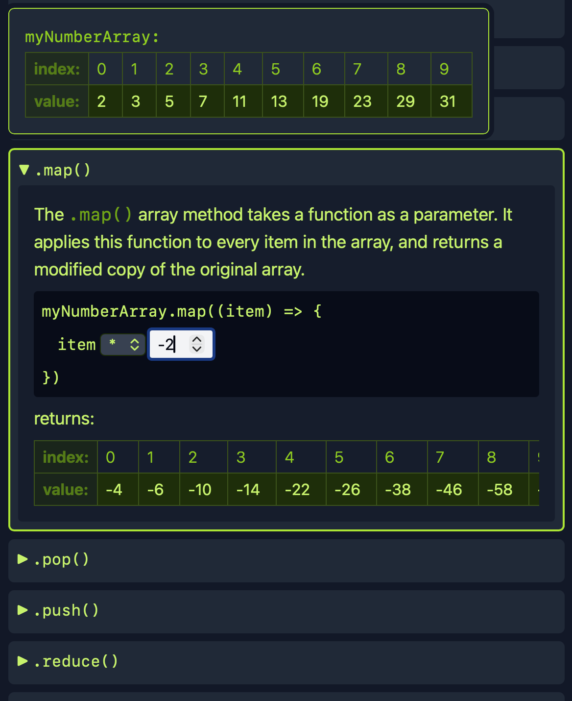
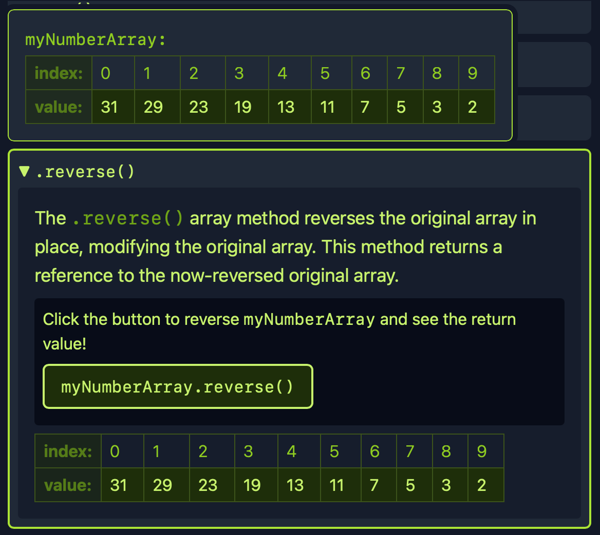

# myNumberArray

[](https://opensource.org/licenses/MIT)

## Description

myNumberArray is a React application that allows you to create your own array, and then explore some of the common methods available to JavaScript arrays.

JavaScript arrays can store many different data types, but for consistency, myNumberArray limits users to an array of numbers.

## Usage

You can test the application using ```npm run dev```. Vite will open it in your browser using a local host. Then, simply follow the instructions to create your number array and test out different methods on it!










## License

This project uses an [MIT License ↗️](./LICENSE.txt).