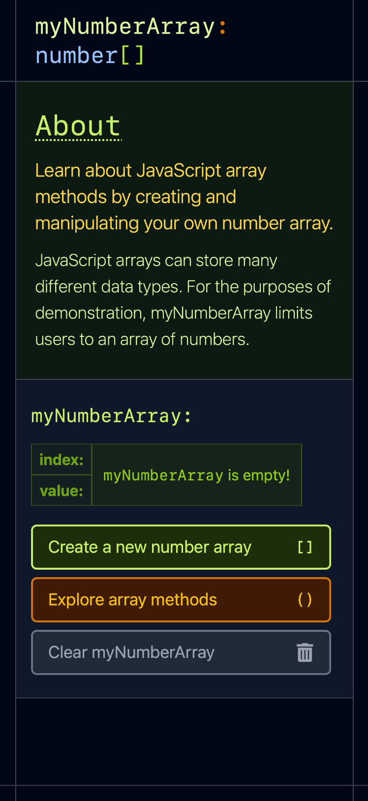
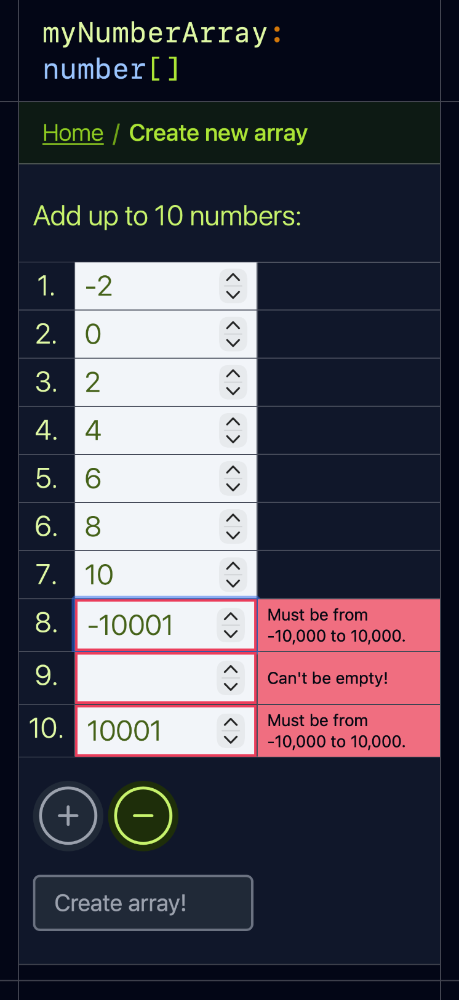
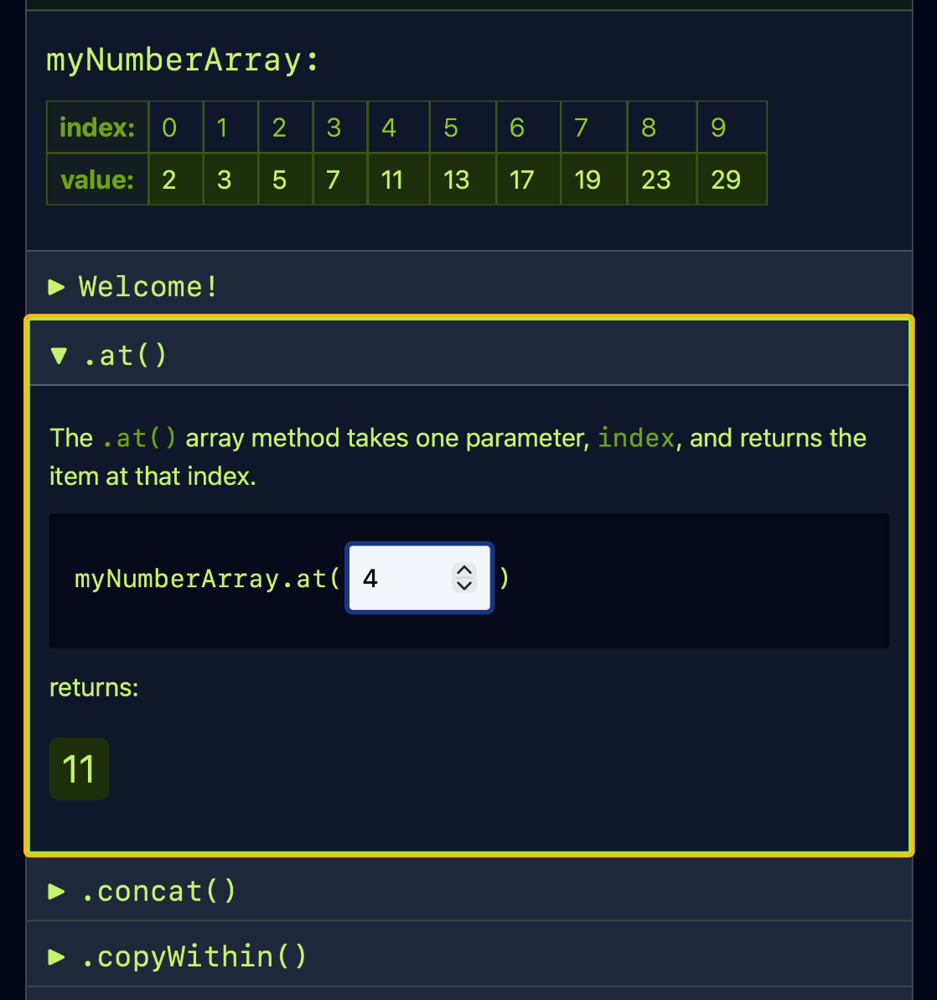
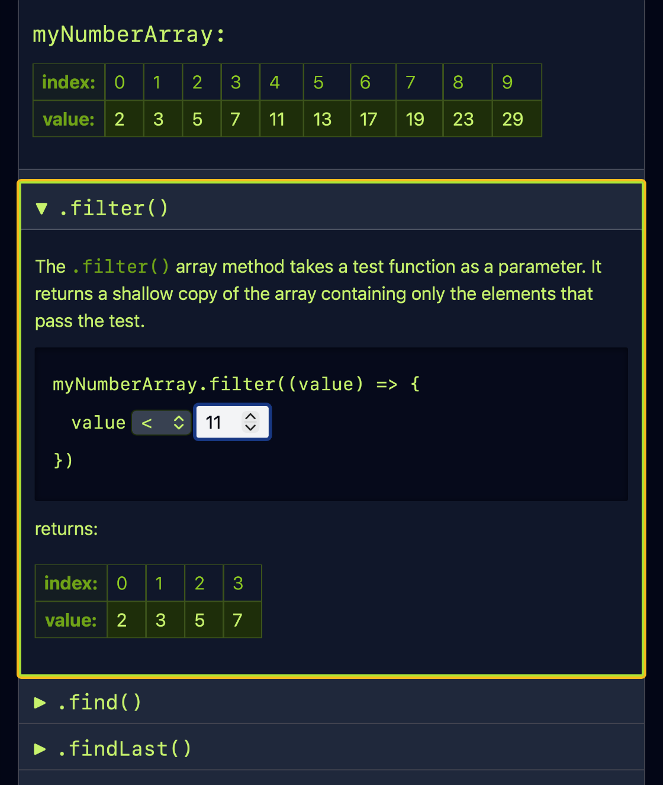
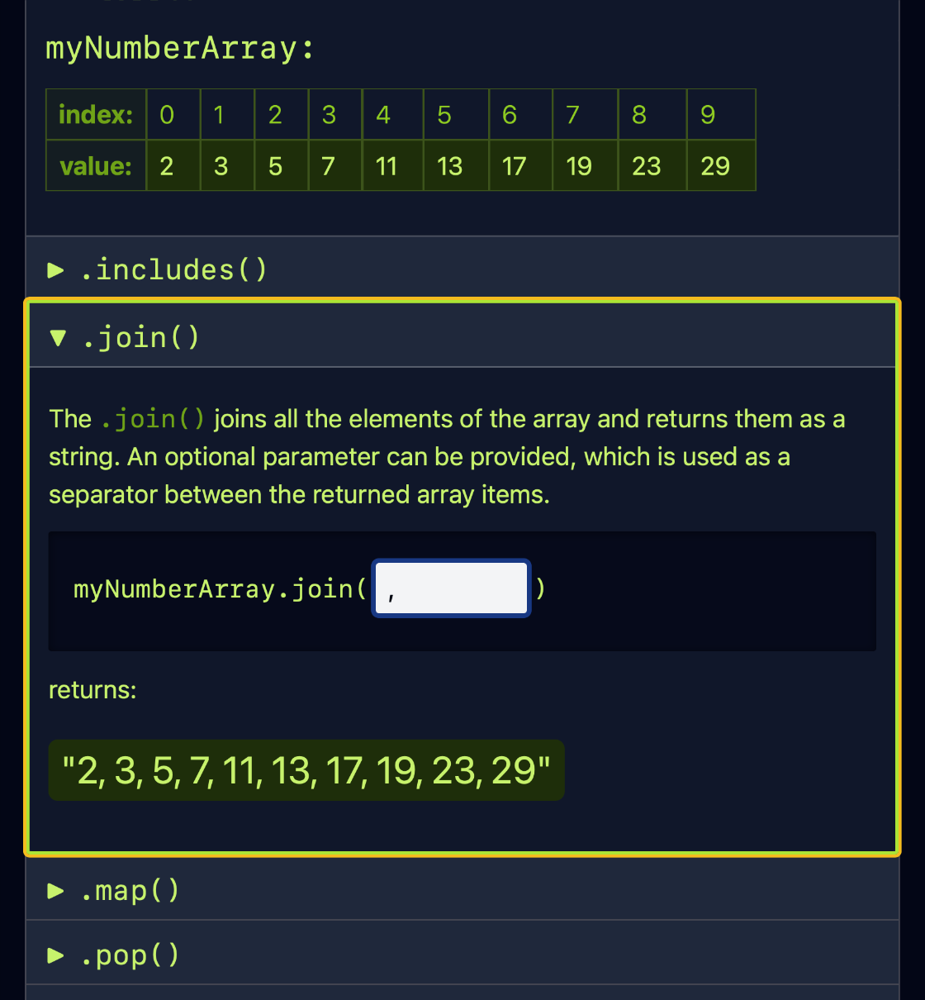
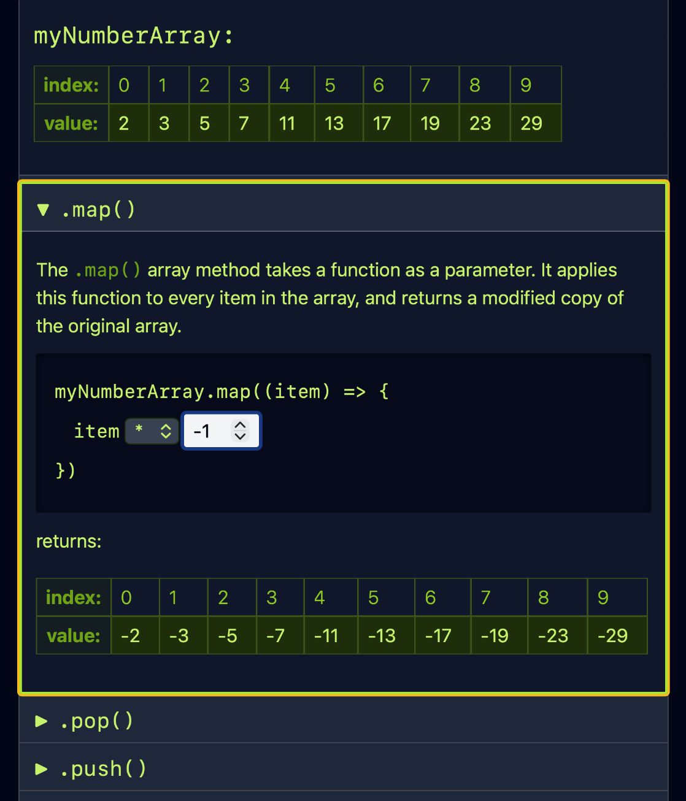
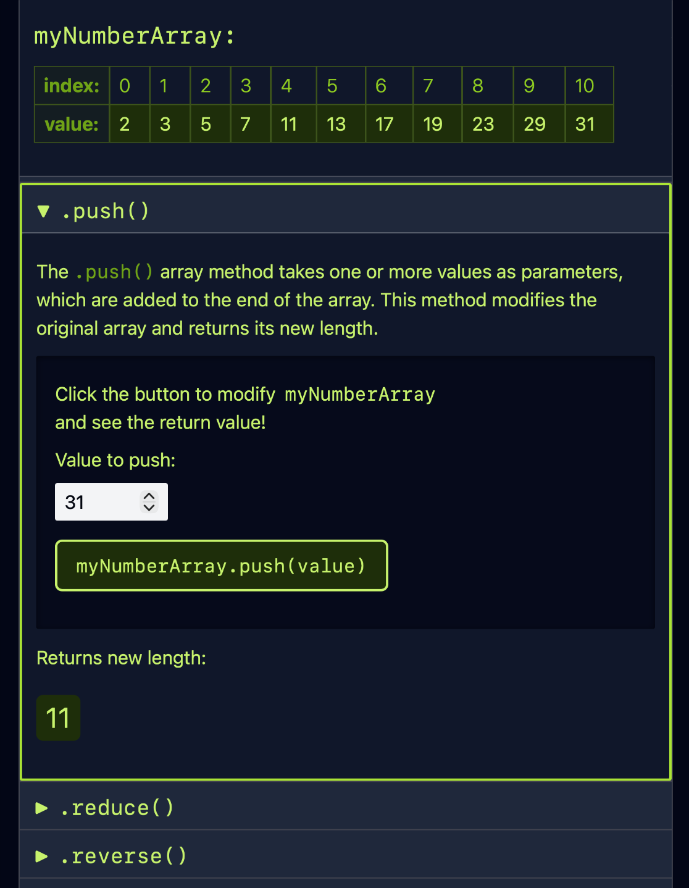
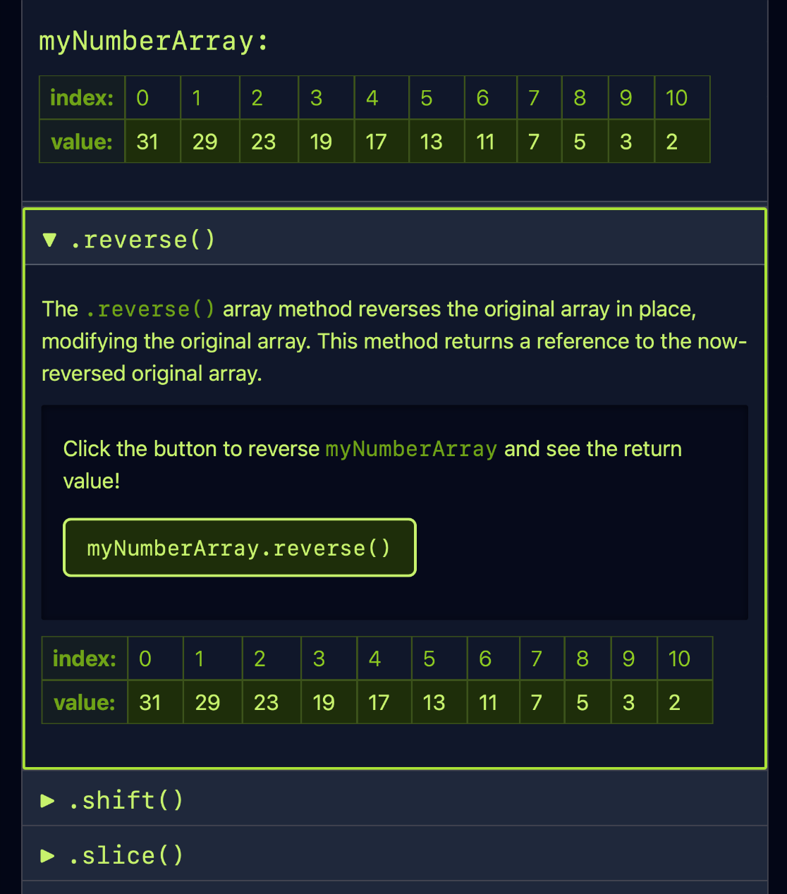
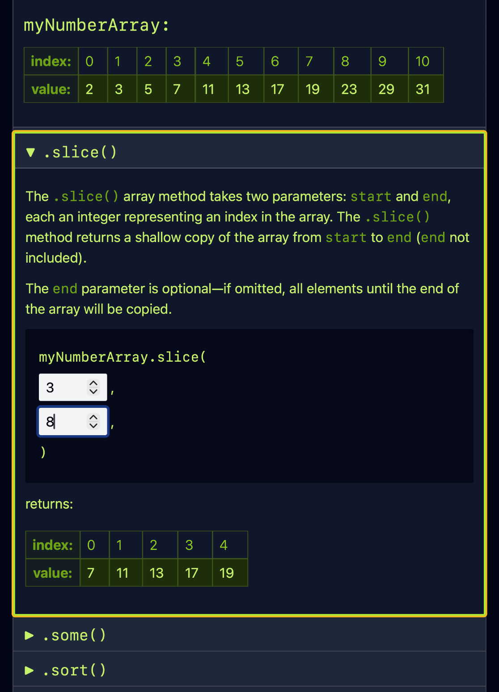

# myNumberArray

## Description

myNumberArray is a React application that allows you to create your own array, and then explore some of the common methods available to JavaScript arrays.

JavaScript arrays can store many different data types, but for the purpose of consistent and predictable interactions, myNumberArray limits users to an array of numbers.

## Tech Stack
- **Framework:** React
- **Language:** TypeScript
- **Styling:** Tailwind CSS
- **Animation:** Motion
- **Linter:** ESLint
- **Formatter:** Prettier

## Usage

[Check out the live site here](https://my-number-array.netlify.app)!

To run in development mode, you can test the application using `npm run dev`. Vite will open it in your browser using a local host. Then, simply follow the instructions to create your number array and test out different methods on it!

## License

This project uses an [MIT License ↗️](./LICENSE.txt).
